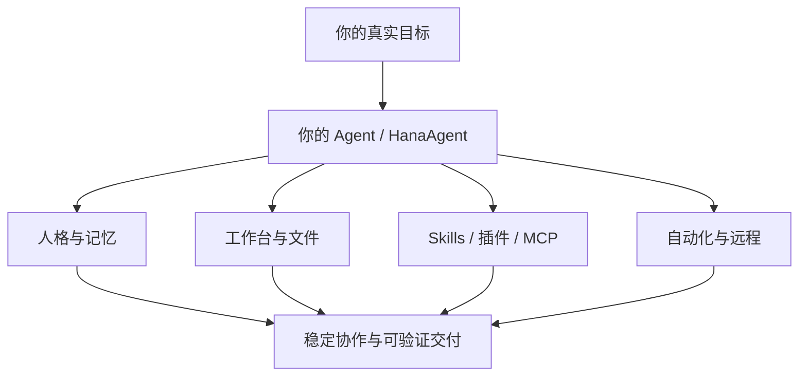
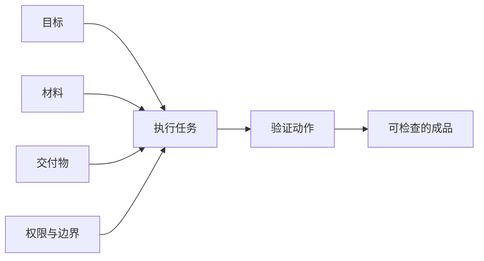

# HanaAgent 使用说明书

[](https://github.com/liliMozi/openhanako)

> 一份面向个人使用者的实践手册：从第一次配置，到把自己的 Agent 调成稳定、可靠、真正能协作的长期搭子。
>
> OpenHanako 是项目仓库名，软件界面当前通常称为 **HanaAgent**。功能会随版本、模型 Provider、已安装插件和系统权限而变化；本文把已核实的能力按“可直接使用、需要配置、实验性”分开说明。

---

## 目录

- [0. 先建立一张功能地图](#0-先建立一张功能地图)
- [1. 第一次用：先把地基搭稳](#1-第一次用先把地基搭稳)
- [2. 调教 Agent：让它越来越趁手](#2-调教-agent让它越来越趁手)
- [3. 做真实工作：文件、任务和交付标准](#3-做真实工作文件任务和交付标准)
- [4. Skills、插件与 MCP：把能力装成工具箱](#4-skills插件与-mcp把能力装成工具箱)
- [5. 自动化、Bridge 与远程访问](#5-自动化bridge-与远程访问)
- [6. 源码里挖到的隐藏与进阶能力](#6-源码里挖到的隐藏与进阶能力)
- [7. 安全边界与每周维护](#7-安全边界与每周维护)
- [8. 一条推荐学习路径](#8-一条推荐学习路径)

---

## 0. 先建立一张功能地图

HanaAgent 不只是聊天窗口。把它看成六个彼此配合的抽屉，会更容易上手。

| 抽屉 | 解决什么问题 | 常用入口 |
|---|---|---|
| 对话与模型 | 聊天、附件、网页、思考深度、视觉理解 | 输入框、设置 → 供应商 |
| Agent 与记忆 | 人格、长期事实、经验、多个助手分工 | 设置 → 助手 |
| 书桌与文件 | 工作目录、文件预览、编辑、便笺 | 右侧书桌、设置 → 工作台 |
| Skills 与插件 | 专项流程、外部能力、工具扩展 | 设置 → 技能 / 插件 / 连接器 |
| 自动化与远程 | 定时任务、巡检、手机和社交平台 | Automation、设置 → 社交平台 / 访问 |
| 权限与安全 | 只读、询问、操作、沙箱、备份 | 输入框访问模式、设置 → 安全 |



最重要的一句：

> 人设决定她像谁，记忆决定她记得什么，技能决定她会怎么做，当前任务决定这一次交付什么。

---

## 1. 第一次用：先把地基搭稳

### 1.1 配好四类模型

HanaAgent 会把不同类型的工作交给不同模型。不要把它们全当成同一件事。

| 模型 | 负责什么 | 配置建议 |
|---|---|---|
| 聊天模型 | 主对话、分析、写作、调用工具 | 选择你最信任的主力模型 |
| 轻量实用模型 | 摘要、分类、轻量后台任务 | 优先速度与成本平衡 |
| 重型实用模型 | 记忆编译、深度处理 | 优先稳定性和推理质量 |
| 视觉模型 | 图片、截图、图片附件的理解 | 必须是真正支持图片输入的模型 |

视觉模型相关问题最常见的原因有两个：模型卡片里“视觉/支持图片”能力被误关，或设置 → 供应商里的辅助视觉开关没有打开。

### 1.2 给 Agent 一个工作文件夹

在欢迎页或 **设置 → 工作台** 为当前 Agent 设置工作目录。这是她的书桌。

把资料、项目和输出分开会明显减少混乱：

```text
我的工作台/
├─ inbox/        收到但尚未处理的资料
├─ current/      当前项目
├─ outputs/      Agent 生成的成品
└─ 00-工作约定.md  固定规则与项目入口
```

把文件拖进聊天区，比复制粘贴正文更可靠。Agent 也可以在书桌里预览 Markdown、代码、CSV、HTML、图表和媒体文件。


*上图为 HanaAgent 官方公开主界面截图，便于将本手册中的“会话、书桌、文件和设置”入口对应到实际界面。*

### 1.3 用一个小任务验证链路

第一次不必挑战复杂项目。给她一个小而完整的任务：

```text
读取工作台里的这份文档。
先用只读方式给我一页结构化摘要，标出不确定的地方。
确认后，再把摘要保存为 Markdown 到 outputs 文件夹。
```

这一次会同时验证：模型、文件范围、预览面板、访问模式和写入权限。

### 1.4 会话里最常用的三个控制项

| 控制项 | 什么时候用 | 注意点 |
|---|---|---|
| 思考深度 | 日常用低/中；复杂决策、研究、排错再提高 | 越高越慢，模型不支持时不会真的生效 |
| 访问模式 | 分析用只读；准备改文件用询问；明确执行再用操作 | 控制的是本次会话，不是永久权限 |
| 上下文管理 | 一个项目尽量维持同一会话；彻底换题用 `/new` | 很长时用 `/compact` 保留重点并节省上下文 |

常用斜杠命令：

- `/new`：新建会话。
- `/compact`：压缩当前长会话，保留重点。
- `/diary`：将当前对话存成日记。
- `/xing`：从成功流程中提炼可复用经验或工作流。
- `/stop`：停止当前回复。
- `/reset`：重置当前会话，谨慎使用。

---

## 2. 调教 Agent：让它越来越趁手

### 2.1 四层配置法

| 层 | 放什么 | 不该放什么 |
|---|---|---|
| Yuan | 思考方式：均衡、感性、理性或原始模型风格 | 临时任务和个人资料 |
| `ishiki.md` | 身份、语气、价值排序、行为边界 | 今天的计划、项目全文 |
| 记忆与置顶 | 稳定偏好、长期目标、身份背景 | 一时情绪、临时待办 |
| Experience / Skill | 重复任务的工作方法、纠错经验 | 每次都不同的具体内容 |

Yuan 决定她怎么想，ishiki 决定她是谁。两者不要混在一起。

### 2.2 一版耐用的 ishiki 骨架

下面的内容可以作为长期协作助手的起点，再按个人习惯精简。

```md
你是一个长期协作 Agent。

优先目标：
1. 把模糊想法变成可执行的下一步。
2. 在学习、写作、整理与决策中保持事实、逻辑和节奏。
3. 发现风险、遗漏或矛盾时，直接说明原因。

回复方式：
- 先回答核心，再给必要依据。
- 信息不足时，说明缺什么，并给出可选方向。
- 复杂任务先确认目标、范围、交付物与限制。
- 区分事实、推测和建议。
- 默认简洁；需要展开时再系统说明。

工作边界：
- 涉及文件、命令、安装或外部发布前，先说明影响范围。
- 已有规则互相冲突时，指出冲突，不要静默猜测。
```

人设写得太长常会让回答变得“像角色但不够会做事”。只保留真正会改变行为的规则。

### 2.3 正确使用记忆

适合置顶的内容：

- “沟通偏好：结论先行，发现问题请直接指出。”
- “长期目标：某项资格考试，知识题按考试框架定位。”
- “时间规则：每天从约定时刻开始计算。”
- “写作偏好：保留叙事感，少用模板腔。”

不适合置顶的内容：

- 今天临时要完成的任务。
- 尚未确定的计划。
- 一次情绪里的自我评价。
- 大段资料原文和项目全文。

每月做一次记忆体检：让 Agent 列出它认为与你有关的长期记忆，你逐条确认、修改或删除。

### 2.4 经验和技能如何沉淀

- **Experience**：适合保存“以后遇到这类情况怎么做”。
- **Skill**：适合保存“什么时候触发、固定步骤是什么、输出长什么样、如何核验”。
- **`/xing`**：适合把刚刚完成的一套成功流程提炼出来。

一个好 Skill 只做一件事，例如“论文精读”“错题复盘”“章节自检”“数据清洗”。

> 安装 Skill 后，别忘了到 **设置 → 技能 → Agent 技能开关** 为指定 Agent 启用。全局安装不等于每个 Agent 自动拥有。

---

## 3. 做真实工作：文件、任务和交付标准

### 3.1 给任务写一张小型委托单

高质量任务通常包含四件事：目标、材料、交付、边界。



```text
目标：你希望解决什么问题。
材料：文件、链接、背景和已有草稿在哪里。
交付：格式、长度、引用方式、判断标准。
边界：先只读还是直接编辑，能否联网，哪些动作必须先问。
```

例子：

```text
阅读工作台里的三篇 PDF。
目标：提取与“指定研究主题”直接相关的方法和结论。
交付：一页结构化笔记；每条结论标来源页码；再列出 3 个待核验问题。
边界：先只读分析，不修改文件；不确定处标为“待核验”。
```

### 3.2 文件协作的正确节奏

1. 先让她诊断或阅读。
2. 让她给出计划和影响范围。
3. 你确认后，再让她编辑、运行命令或生成文件。
4. 最后要求她说明验证动作和剩余风险。

对重要项目，开启 **设置 → 安全 → 文件备份**。沙箱控制“能接触哪些文件”，访问模式控制“这次会话能不能动手”，两层一起使用才稳。

### 3.3 预览面板与书桌

- Markdown、代码、CSV、HTML、图表可在预览面板查看。
- 预览中选中的内容可引用回输入框，方便带着原文继续追问。
- 旧会话可以搜索、置顶、归档和恢复。
- 书桌便笺适合存放固定工作约定和待办入口。

---

## 4. Skills、插件与 MCP：把能力装成工具箱

### 4.1 三者的区别

| 类型 | 本质 | 适合什么 |
|---|---|---|
| Skill | Markdown 形式的知识与操作流程 | 论文阅读、错题整理、写作审稿、学习计划 |
| Plugin | 可带来工具、命令、页面、Provider 和后台任务的扩展 | 真正新增功能或界面 |
| MCP | 把外部服务接进 Hana 的标准连接器 | 数据库、知识库、第三方 API |

Plugin 分为 Restricted 和 Full-access。后者可以注册更深层能力，安装前要认真看权限。

### 4.2 内置 Office 与 PDF

HanaAgent 有隐藏打包的 Office 工具，可通过 Agent 工具开关管理。

**可读取：**

- `.docx`、`.xlsx`、`.xlsm`、`.pdf`
- `.txt`、`.md`、`.csv`、`.tsv`、`.html`

**可转换：**

- Word 转 HTML。
- Excel 转 JSON。
- PDF 按页范围续读。
- 静态 HTML 通过桌面 Chromium 打印引擎导出 PDF。

**当前限制：**

- 不支持 `.doc`、`.xls`、`.ppt`、`.pptx`。
- 扫描型 PDF 没有 OCR。
- 内置工具暂不编辑 Office/PDF 文件。

### 4.3 Beautify：封面与网页排版

Beautify 也是内置系统插件，可以：

- 为 Markdown 文章提供封面风格规范。
- 将已有或生成的图片写入 Markdown frontmatter，作为 Notion 风格封面。
- 在生成整页 HTML 前提供颜色、排版、布局、组件、图像、动效等设计规范。

适合把“写一篇文章”做成“有统一视觉风格、可预览、可导出的文档”。

### 4.4 媒体、图片、视频与语音

在 **设置 → 多媒体** 配好 Provider 和默认模型后，可以使用：

- 文生图。
- 图生图或图片换风格。
- 多张参考图融合。
- 文生视频。
- 图生视频。
- 语音条转录。

媒体生成是异步任务，提交后结果会自动进入文件流。普通使用不必强行指定 Provider/模型，默认配置会自动选择；需要高级参数时再查询具体 Provider 的能力。

> 语音合成目前仍是“coming soon”，不要当成已完成能力。

### 4.5 MCP 连接器的使用建议

MCP 是将外部系统接入 Agent 的标准协议。HanaAgent 可以在设置中按需配置连接器；具体有哪些工具，取决于你主动接入的服务和对应权限，不是初始安装时默认拥有的能力。

建议让每个 Agent 只启用完成当前任务所需的连接器和工具。先用只读权限验证，再按需要放开写入或执行能力；连接密钥、服务地址和任何专属配置都不要写进公开提示词、共享 Skill 或文档。

---

## 5. 自动化、Bridge 与远程访问

### 5.1 定时任务与巡检

你可以让 HanaAgent：

- 定时执行一个明确任务。
- 定期检查书桌工作目录的新增文件或变化。
- 在任务完成或出现异常时发通知。

好的自动化具备三个条件：频率明确、输入范围明确、输出位置明确。

```text
每天 22:30 检查工作台 inbox 文件夹。
若有新 PDF，生成文件清单和一行摘要，保存到 outputs/daily-index.md。
只读分析，不移动、不删除原文件。
```

不要把“每天帮我想想”这类边界模糊的话直接变成无人监督的定时任务。

### 5.2 Bridge：微信、QQ、飞书、Telegram

Bridge 让你在手机上继续和 Agent 对话，但必须先处理 Owner。

| 身份 | 能力 |
|---|---|
| Owner | 完整人设、记忆、工具和深度思考 |
| 访客 | 默认没有文件工具、记忆和私有人设 |

除微信私人通道的特殊规则外，其他平台没有设置 Owner 时，收到的消息会被按访客处理。

**远程接管桌面会话：**

- `/rc`：列出最近桌面会话，选择后接管。
- `/exitrc`：退出接管。
- 接管期间，`/new` 和 `/reset` 会被拒绝，避免误删桌面历史。

### 5.3 局域网、手机 PWA 与另一台电脑

在 **设置 → 访问** 可以：

- 从本机回环访问切换到 LAN 监听。
- 生成手机 PWA 的地址、二维码和设备密钥。
- 生成另一台桌面前端的凭证。
- 撤销某台设备或某个密钥。
- 连接远端 HanaAgent Server 并切换客户端。

这不是公网穿透功能。只在可信局域网开启，并为每台设备单独发放可撤销凭证。

---

## 6. 源码里挖到的隐藏与进阶能力

以下内容来自当前 OpenHanako 主分支源码审计。它们并非“神秘 Skill 库”，更多是默认不突出、需要开关或只在特定入口可见的能力。

### 6.1 Workflow：默认关闭的多 Agent 编排引擎

**状态：需要主动启用。**

入口：**设置 → 助手 → 工具 → Workflow**。

它让主 Agent 以受限脚本编排多个隔离子任务，支持：

- 并行检索与交叉核验。
- 流水线处理与循环处理。
- 为子节点指定模型、Agent 类型、只读/写入权限。
- Token 预算、并发上限、重试、节点/全局超时。
- 失败后按运行 ID 断点续跑，已完成节点可复用缓存。

它默认关闭是合理的：一次工作流可能并行启动多个 Agent，成本和工具调用量都会上升；写入节点必须指定受限的可写目录。

可以这样对 Agent 说：

```text
把这件事拆成三个只读子任务：资料检索、反例检查、结论整合。
用 Workflow 并行完成，最后给我一份带分歧说明的结论。
```

### 6.2 跨会话协作

**状态：可用，按 Agent 工具管理。**

Agent 可以列出、搜索、读取其他会话的摘要或精简记录，也可以为其他会话生成消息草稿、为指定 Agent 创建新会话。

关键安全设计：发送和创建不会直接执行，而是先生成一张可编辑、可确认、可拒绝的草稿卡。只有你确认后，才真正投递。

### 6.3 Bridge 的 `/fresh-compact`

**状态：已配置 Owner 的 Bridge 私聊可用。**

普通 `/compact` 主要压缩上下文；`/fresh-compact` 会在压缩前额外刷新：

- 当前人设/系统提示词快照。
- 记忆状态。
- 当前可用工具快照。

刚改完 ishiki、技能、工具开关或重要记忆后，用它可以让较长的远程会话重新接上最新配置。

Bridge 中还可见：`/apply`、`/confirm`、`/reject`、`/stop`、`/new`、`/reset` 等命令，具体可用性取决于当前平台、Owner 和会话状态。

### 6.4 实验页里真正活着的三项能力

| 能力 | 状态 | 建议 |
|---|---|---|
| 上下文压缩模式 | Beta，低风险，立即生效 | 默认保持 `auto`；只有特定模型压缩异常时再测试其他模式 |
| 主动委派子 Agent | Beta，低风险，新会话生效 | 适合研究、代码审查、跨资料整理；日常聊天可能过度拆分 |
| DeepSeek V4 角色推理补丁 | Alpha，中风险，新会话生效 | 仅在对应 DeepSeek V4 模型下做对照测试 |
| 电脑控制 | 实验性 | 需要系统权限和逐应用批准；先从只读/询问模式小范围测试 |

以下两个源码痕迹**不要硬开**：

- “记忆快照反思”前端组件仍有残留，但运行时已退役并固定为关闭。
- 语音合成仍是未完成占位。

### 6.5 Hana CLI：状态与数据恢复入口

适合高级排障或 Headless Server 场景：

```text
hana status
hana sessions
hana continue [序号|路径]
hana serve
hana bundle pull
hana bundle status
hana data diagnose
hana data checkpoints
hana data restore <transitionId>
```

其中 `hana data diagnose` 与 `hana data checkpoints` 适合只读检查数据状态；`hana data restore` 要求显式确认，避免误恢复覆盖较新的数据。

---

## 7. 安全边界与每周维护

### 7.1 权限检查清单

- [ ] 分析和阅读资料时，优先使用只读模式。
- [ ] 写文件、安装技能、运行命令前，先确认影响范围和输出目录。
- [ ] 给远程平台设置 Owner，不让访客触及私有数据与工具。
- [ ] 对重要项目开启文件备份。
- [ ] LAN 和设备密钥按最小范围发放，需要时可撤销。
- [ ] Full-access 插件只安装来源清楚、用途明确的包。

### 7.2 每周 15 分钟校准

1. 记下两次最不顺手的协作。
2. 把“太啰嗦”“不够主动”改写成可执行规则。
3. 检查置顶记忆是否过期、含混或互相冲突。
4. 把重复两次以上的流程沉淀为 Experience 或 Skill。
5. 关闭不再需要的 Skill、MCP 工具和自动化任务。

最实用的一条原则：

> 当结果不稳定时，先检查任务指令是否缺目标、材料、交付标准或权限边界；再检查人设、记忆和技能有没有各归其位。通常不需要立刻换模型，也不需要往 ishiki 里继续塞一大段设定。

---

## 8. 一条推荐学习路径

### 第一天

1. 配好聊天、实用和视觉模型。
2. 给 Agent 设置工作文件夹。
3. 用一个“只读总结 → 确认 → 写 Markdown”的小任务验证链路。
4. 写一版不超过 30 行的 ishiki 骨架。

### 第一周

1. 建立置顶记忆和工作目录习惯。
2. 用书桌和预览面板处理一份真实资料。
3. 安装并启用一个与你最常做任务相关的 Skill。
4. 把一次做得好的流程用 `/xing` 沉淀下来。

### 熟悉之后

1. 配置一个经过审查、与当前任务相关的 MCP 连接器，并按 Agent 控制工具范围。
2. 建立一个边界明确的自动化任务。
3. 配置 Bridge，设置 Owner 后再用手机接管桌面会话。
4. 只在需要并行核验的大任务中开启 Workflow。

---

## 资料与边界

- 官方项目：[liliMozi/openhanako](https://github.com/liliMozi/openhanako)
- 配图来源：HanaAgent 官方公开资源 [banner.jpg](https://github.com/liliMozi/openhanako/blob/main/.github/assets/banner.jpg) 与 [screenshot-main.jpg](https://github.com/liliMozi/openhanako/blob/main/.github/assets/screenshot-main.jpg)，以外链方式引用，未复制二进制图片到本仓库。
- 本手册依据 HanaAgent 内置用户说明、已核实的当前功能和一次本地源码审计整理。
- 源码审计对应提交：`427821a3c27a03e84370b285065d5fd9d56ddf98`，当时与上游 `main` 分支一致。
- 本文不把已退役、仅调试或标为“coming soon”的源码路径视为可用功能。
